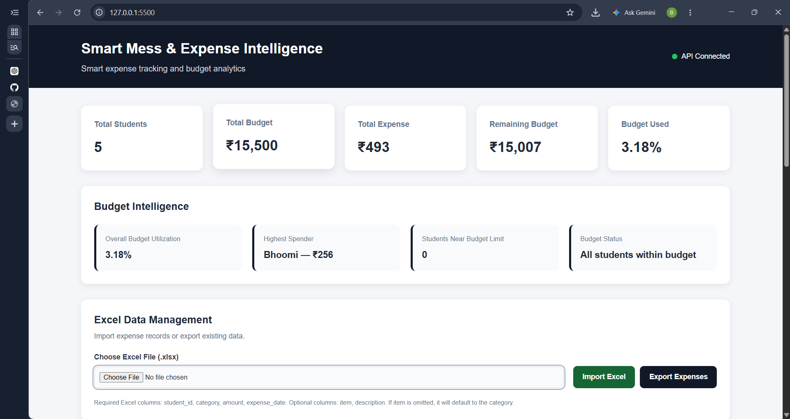
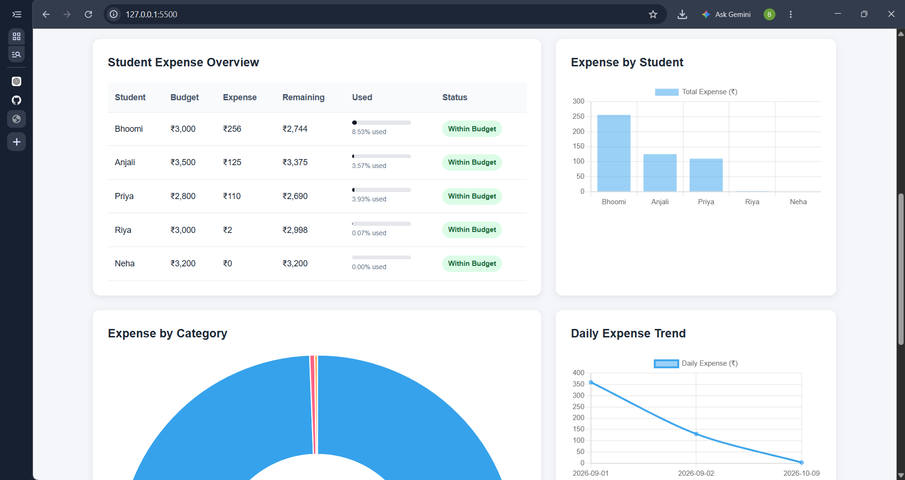
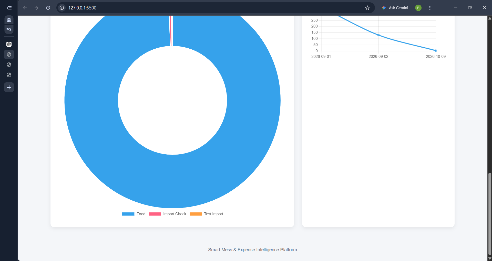

# Smart Mess & Expense Intelligence Platform

A web-based expense tracking and budget analytics platform built to manage student expenses and monitor mess budgets.

## Features
- Student expense tracking
- Budget utilization and remaining budget calculations
- Highest spender identification
- Student-wise expense overview
- Expense analytics charts
- Excel expense import and export
- REST API built with FastAPI
- MySQL database integration

## Tech Stack
- **Backend:** Python, FastAPI
- **Database:** MySQL
- **Data Processing:** Pandas
- **Frontend:** HTML, CSS, JavaScript
- **Charts:** Chart.js
- **Excel:** OpenPyXL
- **API Server:** Uvicorn

## Project Modules
- Student management
- Expense analytics
- Budget intelligence
- Excel data management
- Interactive dashboard

## Setup
1. Install Python and MySQL.
2. Create a virtual environment.
3. Install the required Python packages.
4. Configure database credentials in a local `.env` file.
5. Start the FastAPI backend.
6. Start the frontend using a local HTTP server.

## Security
Database credentials and environment files should never be committed to GitHub.

## Project Status
Core dashboard, analytics, database connectivity, and Excel import/export functionality implemented and tested.

## Dashboard Screenshots

### 1. Dashboard Overview

### 2. Expense Analytics

### 3. Student Expenses

